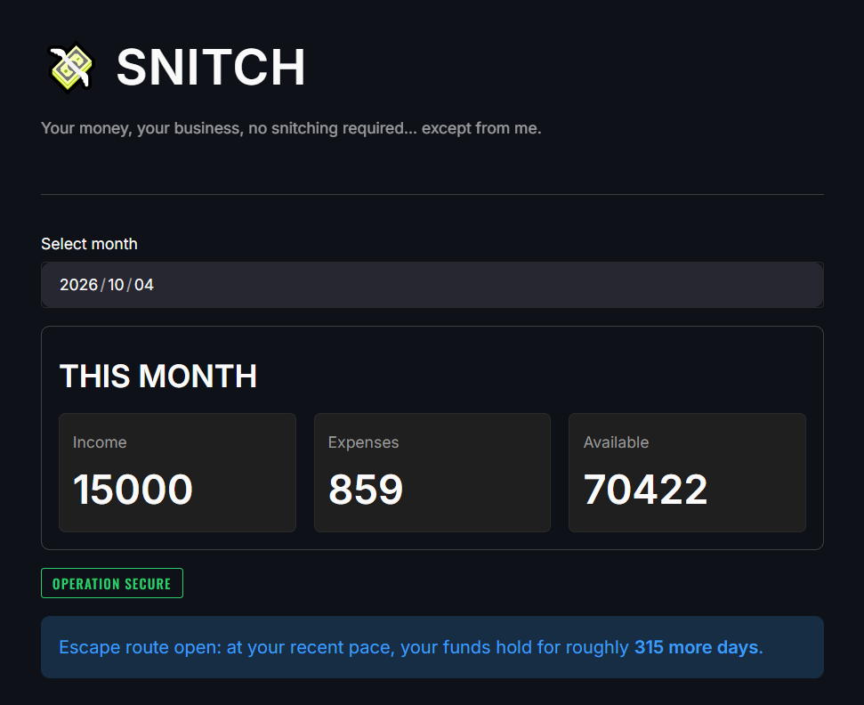
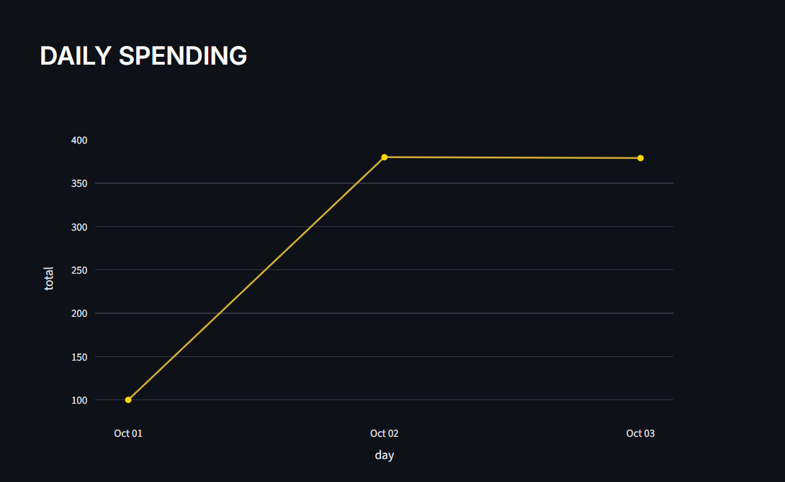
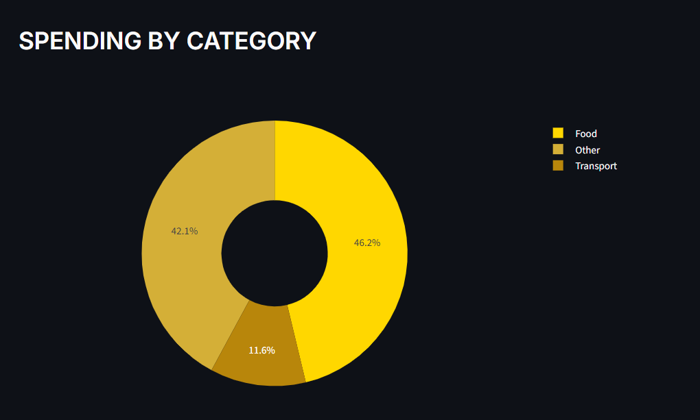
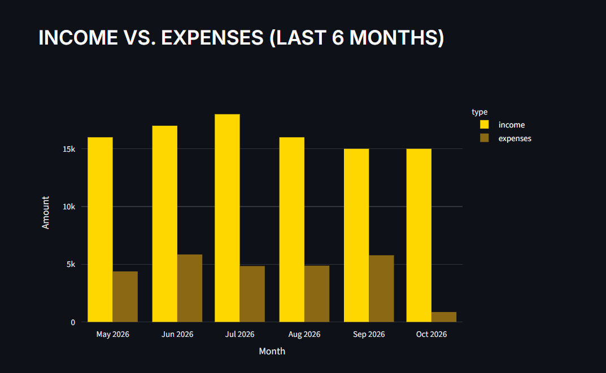

<div align="center">


<br/>


<br/><br/>

> *"Beware of little expenses; a small leak will sink a great ship."*
> — **Benjamin Franklin**

<br/>

</div>

---

## ◈ Why I Built This

Living in a dorm means allowance, part-time gigs, and the occasional gift — no predictable monthly paycheck. Most budgeting apps assume a fixed income and a fixed monthly budget. Snitch doesn't: it works off your actual running balance (everything you've earned minus everything you've spent, carried forward month to month), and it generates its budget warnings and runway estimate from that balance, not from a number you have to set and maintain yourself.

---

## ◈ Features

- **Income & expense tracking** with timestamps (not just dates), so spending patterns by time of day are visible, not just by day
- **Categorized expenses** with full CRUD, protected against deleting a category still in use
- **Monthly dashboard**: income, expenses, and available balance, carried forward correctly across months
- **Budget alerts** based on your real balance, not a fixed monthly cap, with a themed status tag — *Operation Secure* / *At Risk* / *Compromised*
- **Runway estimate**: "your money lasts roughly N more days," based on your recent average daily spend
- **Category-share insights**: flags a category eating up more than half your spending in a given month
- **Trend analytics**: month-over-month comparison per category, ranked two ways side by side — by absolute amount changed and by percentage changed, since those answer different questions
- **Reports dashboard**: category breakdown, daily spending, and a 6-month income-vs-expenses view, all Plotly charts, all exportable to CSV
- **Fully tested service layer**: 50+ pytest cases covering validation, edge cases, and budget/trend logic

---

## ◈ Screenshots
<div align="center">

|---|---|
|---|---|
|  |  |
|  | 

</div>

---

## ◈ Getting Started

```bash
git clone https://github.com/MuhammadAhmadHamim/snitch.git

pip install -r requirements.txt

streamlit run app.py
```

The app initializes its own database and default categories on first run — no manual setup needed.

### Try it with sample data

Rather than enter data by hand, seed a few months of realistic sample activity into a separate demo database (your real data, if any, is never touched):

```bash
python -m scripts.seed_demo
```

**Windows (PowerShell):**
```powershell
$env:SNITCH_DB="demo.db"; streamlit run app.py
```

**macOS/Linux:**
```bash
SNITCH_DB=demo.db streamlit run app.py
```

---

## ◈ Project Structure

```
snitch/
├── app.py                   # Home dashboard
├── pages/                   # Streamlit multipage UI
│   ├── 01_Add_Expense.py
│   ├── 02_Add_Income.py
│   ├── 03_Transactions.py
│   ├── 04_Categories.py
│   └── 05_Reports.py
|
├── services/                 # Business logic & validation, no UI code
│   ├── categories.py
│   ├── expenses.py
│   ├── income.py
│   ├── reports.py            # Cross-table queries (budget, trends)
│   └── alerts.py             # Pure threshold/runway logic, no DB access
|
├── db/
│   ├── connection.py
│   └── schema.py
|
├── ui/
│   └── styles.py              # Theme injection
|
├── scripts/
│   └── seed_demo.py
|
├── tests/                     # pytest suite
├── docs/
├── demo.db
├── pyproject.toml
├── requirements.txt
└── README.txt
```

---

## ◈ Design Decisions

- **SQLite over a client-server database.** The whole project is one user, a few thousand rows a year, no concurrent writers. SQLite needs zero setup for anyone cloning the repo — a client-server DB would add friction without adding value at this scale.
- **No fixed `budgets` table.** Early on I considered one, but with irregular income, a fixed monthly limit would be wrong half the time. Budget status instead compares spending against total available resources (opening balance + income) for the month, which adapts automatically to however much money actually came in.
- **Service layer separate from UI.** All validation and business logic lives in `services/`, independently tested, with zero Streamlit imports. The UI layer only calls these functions and displays results or errors — this is what made the test suite possible, and what keeps the app logic reusable if the UI ever changes.
- **Trend comparisons use matching day-ranges, not whole months.** Comparing a half-finished month against a full previous month would be misleading, so "this month so far" is compared against the same day-range last month, with calendar edge cases (like no Sept 31) handled explicitly.
- **Two insight rankings, not one.** Month-over-month changes are ranked both by absolute amount and by percentage change, since a 200% jump in a category you barely spend in and a 20% jump in your biggest category are both real signals, just different ones.

---

## ◈ Known Limitations / Stretch Goals

- No recurring-transaction support yet
- No roommate bill-splitting
- No CSV bulk import (manual entry only, for now)
- Currently local-only; no hosted/deployed version (see *Getting Started* above)

---

## ◈ A Tech Stack

<div align="center">


</div>

## ◈ A Note on This Work

This was built incrementally: database design first, then a fully tested service layer, then the UI, then analytics, then polish. Every piece in `services/` has test coverage before any UI code was written against it — that order was deliberate, not an afterthought.

---

<div align="center">


*Every rupee accounted for. Nothing gets past the ledger.*

</div>